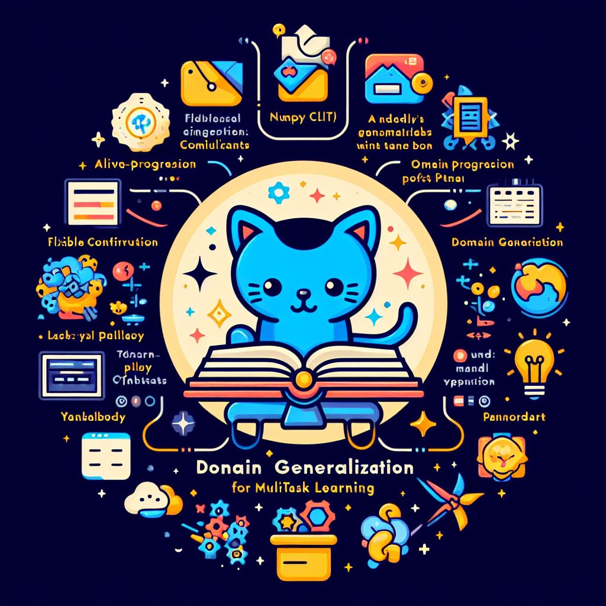

# <span style="color:purple">M</span><span style="color:purple">T</span><span style="color:purple">L</span><span style="color:purple">D</span><span style="color:purple">O</span><span style="color:purple">G</span> - <span style="color:purple">D</span>omain <span style="color:purple">G</span>eneralization for <span style="color:purple">M</span>ulti-<span style="color:purple">T</span>ask <span style="color:purple">L</span>earning

<div style="text-align:center;">
    
    
</div>

[](https://github.com/median-research-group/LibMTL)[](https://github.com/KhoiDOO/mtldog)

## Overview

MTLDOG stands for Multi-Task Learning with Domain Generalization. It is designed to facilitate research and experimentation in the field of multi-task learning, particularly focusing on domain generalization scenarios.

## Features

- **CLI Interaction**: Easily interact with MTLDOG via the command line interface.
- **Flexible Configuration**: Customize various aspects of training, including datasets, tasks, losses, methods, models, and training parameters.
- **Multi-task Learning**: Train models to perform multiple tasks simultaneously, improving efficiency and performance.
- **Domain Generalization**: Incorporate domain generalization techniques into multi-task learning training pipelines.
- **Multi-GPU Support**: Utilize multiple GPUs for training with the capability to select specific GPUs.
- **Logging and Monitoring**: Utilize logging by using WandB for online and offline saving of training progress.

## Usage

First create a virtual environemnt and install all requirements in ```requirements.txt``` as well as Pytorch version that is suitable for your os and system. Note that the repository is created to be used in Linux-based system, which is not guarantee to work well on other os (i.e. Window, Mac).
```
python3 -m venv .env
source .env/bin/activate
python -m pip install -U pip
pip install -r requirements.txt
```
Before using, check wether ```GPU``` and ```CUDA``` are available by initializing a python session by ```python```, then
```
Python 3.10.12 (main, Nov 20 2023, 15:14:05) [GCC 11.4.0] on linux
Type "help", "copyright", "credits" or "license" for more information.
>>> import torch
>>> torch.cuda.is_available()
True
```
If the GPU is not available, consider using the note for all required installation here [get-ready](https://github.com/KhoiDOO/get-ready).To use MTLDOG, simply run the `main.py` script with appropriate command-line arguments. Here's an example of how to run MTLDOG:
```
python main.py -h

usage: MTLDOG - Domain Generalization for Multi-task Learning [-h] [--cfp CFP]

options:
  -h, --help  show this help message and exit
  --cfp CFP   Configuration path for training
```

## Requirements
```
wheel
alive-progress==3.1.5
numpy==1.26.4
opencv-python==4.9.0.80
pillow==10.2.0
PyYAML==6.0.1
wandb==0.16.4
albumentations==1.4.1
pandas==2.2.1
tabulate==0.9.0
torch  # Add PyTorch separately as it may have version-specific installation requirements
```

# Table of Contents

1. [Overview](#overview)
2. [Features](#features)
3. [Usage](#usage)
4. [Requirements](#requirements)
5. [Dataset](#dataset)
   - [RotateMnist Dataset](#rotatemnist-dataset)
   - [CityScapes Dataset](#cityscapes-dataset)
6. [Experiment](#experiment)
7. [Logging](#logging)
   - [Verbose Logging](#verbose-logging)
   - [Wandb Syncing & Last Syncing](#wandb-syncing--last-syncing)
8. [Citation](#citation)
9. [Contributor](#contributor)
10. [Contact us](#contact-us)
11. [Acknowledgement & Reference](#acknowledgement--reference)
12. [License](#license)
13. [Detail Parameters](#detail-parameters)

# Dataset
MTLDOG supports various datasets for multi-task learning experiments. Below are some of the datasets currently available:

## RotateMnist Dataset
<details>
  <summary>Detail Information</summary>

The RotateMnist dataset is commonly used for evaluating multi-task learning models on digit classification and image reconstruction tasks across various domains. It consists of rotated MNIST images, where each image is rotated by a certain degree. The dataset provides a challenging setting for multi-task learning, with tasks including:

### Tasks

- [x] **Digit Classification**: Predicting the digit label of each image.
- [x] **Image Reconstruction**: Reconstructing the original image from its rotated versions.

### Domains

The dataset provides three versions of increasing difficulty, each with different numbers of domains:

- [x] **Easy (5 Domains)**: Contains images rotated across 5 domains.
- [x] **Medium (6 Domains)**: Contains images rotated across 6 domains.
- [x] **Hard (10 Domains)**: Contains images rotated across 10 domains.

### Download
This dataset will be automatically downloaded when conducting the experiments. 
</details>

## CityScapes Dataset
<details>
  <summary>Detail Information</summary>
The CityScapes dataset is a large-scale dataset for semantic urban scene understanding. It contains high-quality pixel-level annotations for urban street scenes, making it suitable for various tasks in computer vision and scene understanding. 

### Tasks

Some of the tasks supported by CityScapes include:
- [x] **Semantic Segmentation**: Predicting the semantic labels of pixels in urban street scenes.
- [x] **Depth Estimation**: Estimating the depth or distance of objects in the scene from the camera viewpoint.
- [ ] **Instance Segmentation**: Identifying and segmenting individual objects within urban scenes.
- [ ] **Human Detection**: Detecting and localizing human instances in urban scenes.
- [ ] **3D Object Detection**: Predicting the 3D bounding boxes of objects present in the scene, providing information about their position and size in 3D space.

### Domains
The dataset includes annotations for various environmental conditions:

- [x] **Clear**: Scenes captured under clear weather conditions.
- [x] **Foggy**: Scenes captured under foggy weather conditions.
- [x] **Rainy**: Scenes captured under rainy weather conditions.

### Download
refer to documentation at [DATA.md](./ds/DATA.md)
</details>

# Experiement

The `main.py` script is designed to conduct experiments for multi-task learning using a single JSON configuration file (e.g. [example.json](./hparams/example.json)). This file contains various parameters that define the experiment setup, including dataset, batch size, model architecture, optimization parameters, logging options, and more.

The JSON configuration file follows a specific template but *not limit to* with the following fields:

<details>
  <summary>Detail Params</summary>

- `"ds"`: Name of the dataset to be used for the experiment.
- `"dt"`: Root data directory path.
- `"bs"`: Batch size for training.
- `"wk"`: Number of dataset workers.
- `"pm"`: Boolean value indicating whether to use pin memory.

- `"trdms"`: List of domains used in training.
- `"tkss"`: List of tasks used in training.
- `"losses"`: List of loss functions for each task.

- `"m"`: Method used for training.
- `"model"`: Type of model architecture.
- `"at"`: Type of architecture (e.g., autoencoder, unet).
- `"bb"`: Backbone type (e.g., base, resnet18).

- `"lr"`: Learning rate for optimization.
- `"seed"`: Random seed for reproducibility.
- `"tm"`: Training mode (e.g., supervised).
- `"dvids"`: List of device IDs used in training.
- `"round"`: Number of training epochs.
- `"chkfreq"`: Checkpoint frequency.
- `"port"`: Port for multi-GPU training.

- `"wandb"`: Boolean value indicating whether to use WandB for online logging.
- `"wandb_prj"`: WandB project name.
- `"wandb_entity"`: WandB entity name.

- `"grad"`: Boolean value indicating whether to track gradients.
- `"diseval"`: Boolean value indicating whether to perform distribution evaluation.
- `"verbose"`: Boolean value indicating whether to print verbose output.
- `"synclast"`: Boolean value indicating whether to synchronize the last layer during training.
</details>

For all available parameters and keys that can be used in this project are refered to Section [Detail Parameters](#detail-parameters)

# Logging

## Verbose Logging
Toggle logging by using ```--verbose``` argument. The key used for logging has style of ```<domain>/<split>-<in_domain>?-<task>-<metric/loss>```.
```
on 725: ROUND: 725
on 725: KEY                                                                    VALUE
on 725: ********************************************************************************************************************************************
on 725: 0/train-in-rec-mse                                                     0.008707582950592041
on 725: --------------------------------------------------------------------------------------------------------------------------------------------
on 725: 0/train-in-cls-ce                                                      0.2501453757286072
on 725: --------------------------------------------------------------------------------------------------------------------------------------------
on 725: 10/train-in-rec-mse                                                    0.006822067778557539
on 725: --------------------------------------------------------------------------------------------------------------------------------------------
on 725: 10/train-in-cls-ce                                                     0.2859261631965637
on 725: --------------------------------------------------------------------------------------------------------------------------------------------
on 725: 0/train-in-rec-psnr                                                    24.098766326904297
on 725: --------------------------------------------------------------------------------------------------------------------------------------------
on 725: 0/train-in-cls-acc                                                     0.9375
on 725: --------------------------------------------------------------------------------------------------------------------------------------------
on 725: 10/train-in-rec-psnr                                                   26.12443733215332
on 725: --------------------------------------------------------------------------------------------------------------------------------------------
on 725: 10/train-in-cls-acc                                                    0.921875
on 725: --------------------------------------------------------------------------------------------------------------------------------------------
```
If ```--grad``` is toggled, the ```cosine similarity``` and the ```dot product``` for share and heads gradients accross tasks and domains are then shown. 
```
on 725: grad-share-cos-mat
on 725: +--------+------------+------------+-----------+----------+
        |        |      0-rec |      0-cls |    10-rec |   10-cls |
        |--------+------------+------------+-----------+----------|
        | 0-rec  |  1.00006   | -0.284746  | 0.0497712 | 0.121551 |
        | 0-cls  | -0.284746  |  1.0001    | 0.0898833 | 0.724015 |
        | 10-rec |  0.0497712 |  0.0898833 | 1.00004   | 0.025323 |
        | 10-cls |  0.121551  |  0.724015  | 0.025323  | 1.00009  |
        +--------+------------+------------+-----------+----------+
```

if ```--hess``` is toggled, the **layer-wise** ```cosine similarity``` and the ```dot product``` for share and heads gradients accross tasks and domains are then shown. Otherwise the eigen decomposition for hessian matrix is also performed. 

## Wandb Syncing & Last Syncing
Using ```--wandb``` to enabe saving your experiment into [WandB](https://wandb.ai/). Consider using ```--synclast``` argument to save right after the whole training procedure is done, in case your internet connection is not good (my case), which will faster your experiment so much. If ```--quant``` is toggled, all vectors, tables, metrics, losses and model is logged. 

|   Tag   |   grad   |   hess   |    lw grad   |    lw hess   |  eigen  |  lw eigen  | metric and loss | model |
|:-------:|:--------:|:--------:|:------------:|:------------:|:-------:|:----------:|:---------------:|:-----:|
|  --grad | <input type="checkbox" checked disabled/> | <input type="checkbox" disabled/> | <input type="checkbox" disabled/> | <input type="checkbox" disabled/> | <input type="checkbox" disabled/> | <input type="checkbox" disabled/> | <input type="checkbox" disabled/> | <input type="checkbox" disabled/> |
|  --hess | <input type="checkbox" disabled/> | <input type="checkbox" checked disabled/> | <input type="checkbox" checked disabled/> | <input type="checkbox" checked disabled/> | <input type="checkbox" checked disabled/> | <input type="checkbox" checked disabled/> | <input type="checkbox" disabled/> | <input type="checkbox" disabled/> |
| --quant | <input type="checkbox" checked disabled/> | <input type="checkbox" checked disabled/> | <input type="checkbox" checked disabled/> | <input type="checkbox" checked disabled/> | <input type="checkbox" checked disabled/> | <input type="checkbox" checked disabled/> | <input type="checkbox" disabled/> | <input type="checkbox" disabled/> |

The above table show the tag needed for logging the corresponding information. For example to log *layer-wise hessian* (lw hess), two tag needed to be toggled are ```--hess``` and ```--quant```, while model, metric and loss are logged as default. 


# Citation
If you find this project useful for your research, consider cite it to your research paper.
```
@misc{MTLDOG,
  title={MTLDOG - Domain Generalization for Multi-task Learning},
  author={KhoiDoo},
  year={2024},
  publisher={GitHub},
  journal={GitHub Repository},
  howpublished={\url{https://github.com/KhoiDOO/mtldog}},
  note={Accessed: [15 March 2024]}
}
```

# Contributor

```MTLDOG``` is developed and maintained by [KhoiDoo](https://github.com/KhoiDOO). The extra contributors are:
- [Nguyen Nam Khanh](https://github.com/khanhkhanhlele)
- [Nguyen Minh Duong](https://github.com/skydvn)
- [ChatGPT](https://openai.com/chatgpt), an AI language model developed by OpenAI.
- [Bing AI](https://www.bing.com/), an artificial intelligence developed by Microsoft.


# Contact us

If you have any question or suggestion, please feel free to contact us by [raising an issue](https://github.com/KhoiDOO/mtldog/issues) or sending an email to ``khoido8899@gmail.com``.

# Acknowledgement & Reference
In this part we list all previous projects that did help us in figuring out coding issues in MTLDOG.

- [DomainBed](https://github.com/facebookresearch/DomainBed): A versatile library for domain generalization and adaptation research, developed by Facebook Research.
- [LibMTL](https://github.com/median-research-group/LibMTL): A comprehensive library for multi-task learning research, developed by the Median Research Group.
- [Ultralytics](https://github.com/ultralytics/ultralytics): A powerful computer vision library with state-of-the-art object detection and classification algorithms, developed by Ultralytics.

# License

This project is licensed under the MIT LICENSE - see the [LICENSE](./LICENSE) file for details.

# Detail Parameters

## Dataset & Models


## Loss Function

## Method
